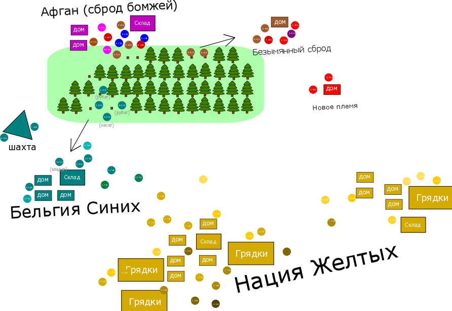

# Netrew (work in progress)
A 2D multiplayer game that will allow you to make your nation great and prosperous.

### TODO
* Everything.
### What is this game about?
I am not sure about the actual gameplay yet, but here are its "key features":
* You will be able to control one or few characters, which are 2D circles that have their own color
* Each character's color will show its origin, e.g red mother + green father = yellow child
* Maybe these characters will have some "diseases" that are inherited by their children with some random chance (will make it later, when there will be minimal gameplay)
* Non controlled by player characters will be controlled by pretty simple bot
* You will be able to have an army & get territories just by invading
* Wars & battles supposed to be rare, because total population is not unlimited. I will also try to balance it more to defenders' side
* There also will be trading between other multiplayer players. One could establish his country's own currency or adopt existing one and sell things (food, iron, weapons) to others by fixed or dynamic price
* This game is more about friendship, colonization, trading, politics and some local conflicts (or World War)
### Release date
I am making this game at my spare time when I have enough inspiration. This is a game of my dream, so I really want to finish it at some time and continue to support.
